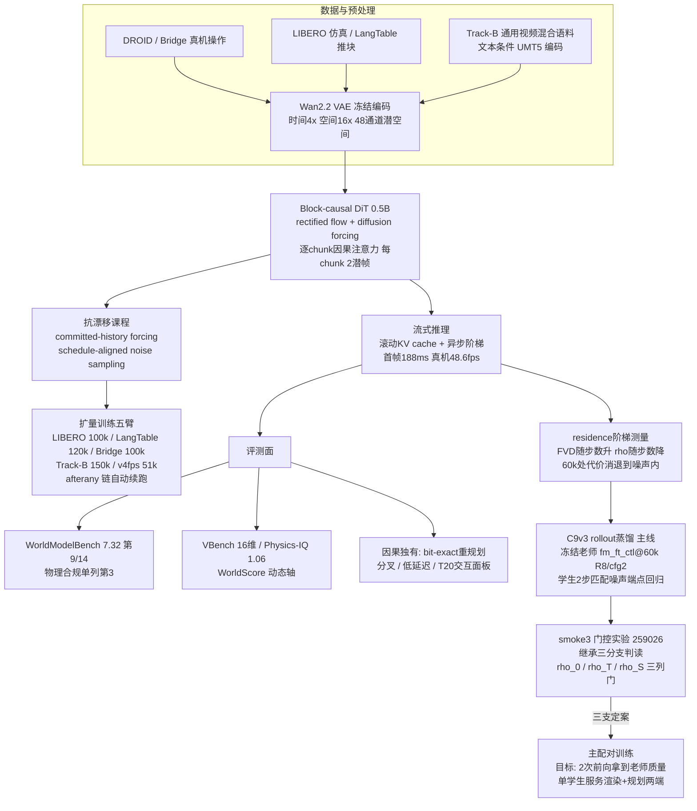

# NC-World 阶段报告（2026-08-25 凌晨）

本项目在做一件事：从零训练一个**原生因果（native causal）视频世界模型**——它像语言模型逐词生成那样逐段生成视频帧，每一帧只依赖过去、绝不偷看未来，因此天生支持流式渲染（边生成边播放）、低首帧延迟、KV cache 复用、在任意时刻分叉出多个未来（planning），这些都是主流双向注意力视频模型做不到或做得很贵的能力。技术栈是学界当前的标准配方：一个 0.5B 参数的 block-causal Diffusion Transformer（DiT，28 层、宽 1152），配 rectified flow 去噪目标（把噪声到图像的路径拉直，少步数就能采样），视频先经冻结的 Wan2.2 VAE 压缩到潜空间（时间 4 倍、空间 16 倍压缩、48 通道），模型在潜空间里以每 2 帧为一个 chunk 自回归生成，训练用 diffusion forcing（同一窗口内不同 chunk 加不同强度的噪声，教会模型在"过去清晰、未来模糊"的流水线状态下工作），推理用滚动 KV cache 让视频可以无限延长。训练数据按域分臂：真实机器人操作（DROID、Bridge）、仿真机械臂（LIBERO）、桌面推块（LangTable），以及一条以对话、运动等通用视频为主的 Track-B 混合语料（窗口 32 潜帧，是文本条件流式生成的主战场）；所有臂都带我们自研的抗漂移课程——committed-history forcing（训练时让模型在"自己生成的历史"而非完美真值上继续预测，弥合训练与推理的暴露偏差）与 schedule-aligned noise sampling（训练时的噪声阶梯对齐推理实际走的阶梯）。

先说这两天最重要的对外结果：项目拿到了**第一个可与公开排行榜同判官同题并读的绝对名次**。WorldModelBench（CVPR'25 的世界模型基准，350 道首帧+指令续写题，覆盖机器人、驾驶、工业等 7 个领域，用官方微调的 VILA 视觉语言模型当裁判）上，我们 0.5B 的 Track-B 模型在 35k 步时总分 **7.32 / 10**（指令跟随 1.43/3、物理合规 4.74/5、常识 1.15/2），在 13 个已发表模型构成的榜单里排**第 9/14**——高于 CogVideoX-I2V (7.08)、Pandora (6.90)、T2V-Turbo (6.56) 与两个 OpenSora 变体，低于 KLING (9.10) 等商业闭源模型；**物理合规单列第 3**（仅次 KLING 与 Mochi 官方版）。两条诚实脚注必须随行：物理高分与我们 VBench 测出的低动态度（dynamic_degree 0.24，真实视频锚 0.615）并读，部分是"动得少就难违反物理"的保守生成红利，不能单独引用为物理理解强；指令跟随在榜单下三分之一，与用户评审指出的"文本条件质量差"一致，正是在跑的扩量训练要买的东西。判分可信度做了双保险：我们逐字复刻官方解析器并写了一个修正解析器同时打分，2450 条裁判回复上两者零分歧、零不可解析，7.32 在两套规则下同值。另外发现该分数生成于中间工作点（有效去噪步数 6），生产端与感知端两个工作点的补充行正在跑，之后引用格式将是"9/14@eff6，同一权重在 eff2 与 eff8 分别为 X 与 Y"。

其他基准分数：Physics-IQ（物理直觉基准，官方协议 V2V 条件化）得分 1.06，管线经 GT 自锚验证（把真值当预测喂进打分器得到满分 100，证明 1.06 是真测量不是单位错误），地板校准与外部锚点还在队列里，引用暂缓；WorldScore 动态三轴在 31k 步时 46.0 / 27.8 / 35.6；VBench 十六维在 35k 步全表落地（与真实视频同管线锚并读：运动平滑度 0.9886 与时序稳定性 0.9804 双双高于真实锚——"比真实更平滑"正是条件均值塌缩的签名），但该跑法是自域 custom-input 协议、与 VBench 官方排行榜不可直接并读，官方 prompt 套件的 T2V 跑法需要先解决无首帧纯文本起步，已立项。受控同码同数据对比里，因果采样器对双向基线四项全胜（PSNR 21.47 vs 17.73、SSIM 0.819 vs 0.644、LPIPS 0.110 vs 0.240、FVD 229.5 vs 1087），且当时因果侧还处在 6–25 倍采样预算劣势下。因果独有能力面板：在线重规划省算 73.7/37.6/35.6%（三种分叉点）且输出与全量重算逐位相同（bit-exact 16/16）；真实机器人域流式生成 253 帧（约 17 秒）实测吞吐 **48.6 fps**（生产 2 步配置、DiT-only 口径，内容速率 15 fps 的 3.24 倍）、**首帧延迟 188 毫秒**（双向基线同项为 5.6 秒）、动作到画面的结构延迟地板 533 毫秒——这三个数分别回答吞吐、启动、响应三个不同的问题。这里还纠了一个表内不可比错误：此前"仿真 57.9 fps 对真机 21.6 fps"的 2.7 倍差距，2.25 倍其实是去噪步数配置差而非域难度差，步数对齐后真机与仿真同档，所有跨域吞吐比较现在必须同步数或声明不可比。

方法学上这两天连续三次反转，最终图景比出发点干净得多。背景是核心失效模式 B1：运动区域被生成成模糊的"条件均值"（雾状涂抹），我们花了十几个训练目标侧的干预臂（改损失、加判别器、方差匹配、方向匹配、Equilibrium Forcing 等）全部无效，判定 B1 相当部分住在**采样侧**：有效去噪步数（residence）从 2 提到 8，FVD 单调改善约 80-90 点、雾变成有承诺的结构，但逐样本机制指标 ρ_rollout（生成增量与真实增量的方向相关性）反而下降约 20%，且漂移同步上升——感知与机制看起来严格对立，没有中间点可站。反转发生在把这套测量搬到步数轴上：同一家族在 10k 步时抬 residence 的 ρ 代价是 0.066（显著），到 60k 步只剩 0.012（落在测量噪声内）——**感知/机制对立是欠训练的瞬态，不是定律**；训练不仅整体改善两个指标（10k 到 24k：FVD 降 64.5 且 ρ 升 0.18），还把两者的交换曲线本身放平。归因侧的因子分解（四条臂恰好同在 7500 步，2×2 设计干净）判定：committed-history forcing 是唯一显著推陡"机制汇率"的旋钮（它买的是绝对质量与抗漂移），schedule-aligned noise sampling 改的不是汇率而是"奖池"——它让 residence 能买到的 FVD 从 +34 翻到 +66，且剂量-响应在高端反转（满剂量 λ=1.0 奖池掉回 +66 以下且汇率恶化，甜区在 0.5–0.75），种子复刻显示奖池测量组间差仅 0.4、极其可靠。

这套测量直接定下了当前的主线实验 C9v3：**rollout 蒸馏**。老师是被 258844 探针判决选定的 fm_ft_ctl@60k 检查点在 8 步去噪、CFG=2 工作点上的完整自回归 rollout（该格 FVD 302.6、ρ 0.4951——探针同时否决了"forced-ρ 峰值检查点当老师"的方案，因为那个峰没有迁移到 rollout 空间）；学生从同一检查点出发，被训练成在自己的 2 步、2 次前向工作点上直接命中老师的逐 chunk 终点（匹配噪声的端点回归：老师和学生从同一份噪声出发，老师积分 8 步的结果就是学生 2 步应到达的靶）。老师完全冻结，"学生把老师侧弄坏来靠拢"的塌缩模式在结构上不存在。价值陈述按算力与墙钟分开：FLOPs 口径是 16 次前向压到 2 次的 8 倍，但墙钟受固定开销限制实际约 1.7 倍——所以 C9v3 是**质量方案不是速度方案**，它买的是"基本不变的延迟下拿到 −42.8 FVD 的感知提升"，并且因为 60k 处机制代价已在噪声内，一个成功的学生有望**同时服务渲染与规划两类消费者**，消除工作点分工。实现已完成并过三重验证（新模块 + 训练接线 + 默认全关的配置字段，六项单元测试含"学生与老师同权重同步数时损失必须为零"的积分等价钉；验证还抓到一处会让门控实验假绿的脚本缺陷并已修复）。门控实验 smoke3（1500 步蒸馏 + 自动三列门）已提交，它要回答的是预注册的继承三分支：学生的 ρ 跟着老师走（继承成立）、与老师无关（继承不成立）、还是系统性低于老师（蒸馏本身损耗机制，最坏支）——判据阈值 δ 也已用配对 bootstrap 校准过（原定 0.010 比测量噪声还严会误杀，校准后按"超过测量噪声才算退步"定义），三支定案之前主训练不开跑。

正在跑的任务与进度（2026-08-25 01:26 快照，速率为各自日志实测）：扩量训练五条臂全部由 afterany 链自动接力，LIBERO 臂 71150/100000 步（0.49 it/s，约 16 小时后到点）；LangTable 臂 95700/120000（0.58 it/s，约 12 小时）；Bridge 臂 55200/100000（0.50 it/s，约 25 小时）；Track-B 主臂 38000/150000（0.09 it/s，前段撞墙钟后其续跑作业正等集群组配额释放，到点约需 13 天，中途 50k/80k 设有判断点）;v4fps 帧率归一化臂 6800/51000（0.09 it/s，约 6 天）。EqF 收官读数所在的 wide 配对第三段已跑 16-17.7 小时，还有 2-4 小时收官，届时 Equilibrium Forcing 程序正式关闭。WMB 两工作点补测已完成生产端 350 条生成、正在裁判打分，全部完成约还需 3-4 小时，出数后 WMB 引用升级为三点区间。C9v3 门控实验 smoke3 在队列里等 GPU（Priority 排序），开跑后训练约 4-8 小时加评测 1 小时，它的三列门读数是主线的下一个决策点。SANS 剂量-响应与老师选点探针均已完成并出判决（结果如上）。所有作业受滚动链守护进程与 chain-aware 监控巡检（每 30 分钟快照，本轮刚修复了链交接后监控读死日志的仪器缺陷，并补上了三条缺失的续跑链节）。

预期结果与下一步：若 smoke3 判继承三支中的任何非最坏支，主配对开跑，目标是学生在 2 次前向达到老师 FVD 302.6 一档（当前学生工作点地板 345.4），同时 ρ 不低于老师超过校准阈值——成功即项目头条能力之一："流式实时预算内的高保真世界模型"。扩量臂到点后，全部 demo 与 benchmark 以新检查点重制（WMB 在 trackb 50k/100k 各重跑一次看轨迹）；VBench-2.0 与 VBench 官方 T2V 协议在无首帧生成 shim 落地后接入。老师家族的配方微调臂（SANS λ=0.5 开、chf 关、配同长度进度控制臂）已设计定稿、挂在 smoke3 判读之后，它的目标是把蒸馏可买的感知奖池从 −42.8 进一步扩大。
